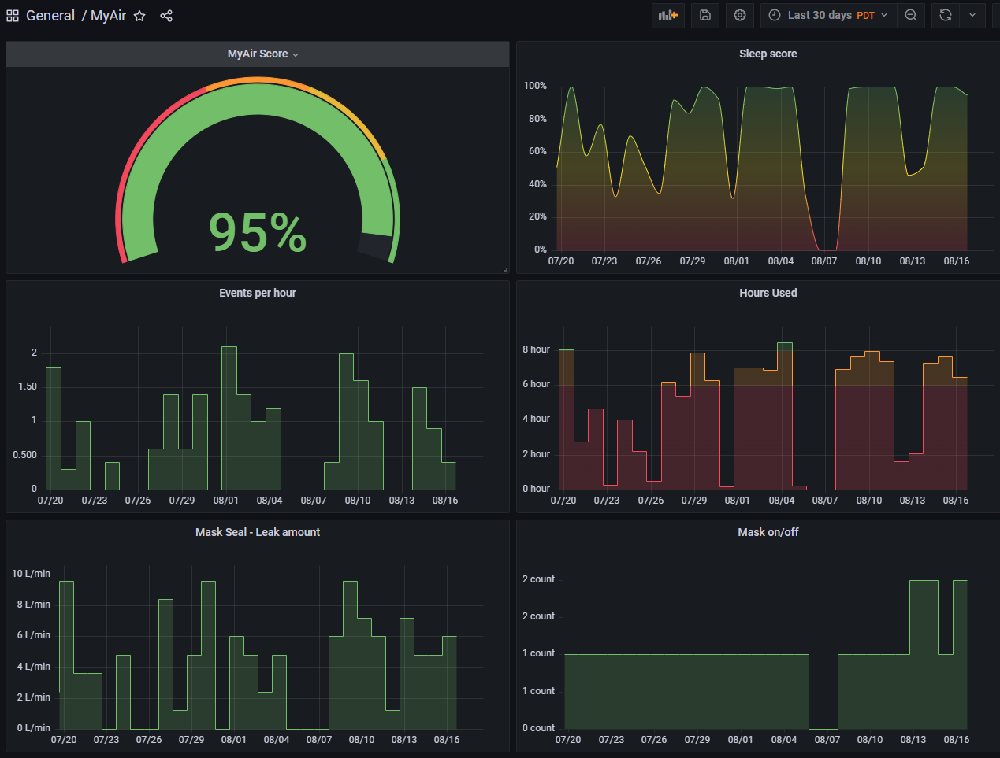

# MyAir Resmed to InfluxDB

Allows for importing [MyAir](https://myair.resmed.com/) data to [InfluxDB](https://www.influxdata.com/).

## Requirements

- The MyAir credentials associated with the [ResMed CPAP](https://www.resmed.com/en-us/sleep-apnea/cpap-products/cpap-machines/) that's uploading MyAir data to the cloud
- A device, capable of running either Docker containers or Python e.g., [Rasbpian](https://www.raspbian.org/) or Windows
- [InfluxDB](https://en.wikipedia.org/wiki/InfluxDB) v2 installed and accessible from the device running the import
- Bucket created on the influxDB and token available

## Setup

Choose one of these 3 methods.

### Using pre-built Docker image (recommended)

1. `touch config.yaml`
2. This will fail due to malformed config.yaml. That's intentional :)
   ``sudo docker run --name myAir -v "`pwd`/config.yaml:/app/config.yaml" vdbg/resmed-influx``
3. `sudo docker cp myAir:/app/template.config.yaml config.yaml`
4. Edit `config.yaml` by following the instructions in the file
5. `sudo docker start myAir -i`
  This will display logging on the command window allowing for rapid troubleshooting. `Ctrl-C` to stop the container.
7. When done testing the config:
  * `sudo docker container rm myAir`
  * ``sudo docker run -d --name myAir -v "`pwd`/config.yaml:/app/config.yaml" --restart=always --memory=100m vdbg/resmed-influx``
  * To see logs: `sudo docker container logs -f myAir`

### Using Docker image built from source

1. `git clone https://github.com/vdbg/resmed-influx.git`
2. `sudo docker build -t resmed-influx-image resmed-influx`
3. `cd resmed-influx`
4. `cp template.config.yaml config.yaml`
5. Edit `config.yaml` by following the instructions in the file
6. Test run: ``sudo docker run --name myAir -v "`pwd`/config.yaml:/app/config.yaml" resmed-influx-image``
   This will display logging on the command window allowing for rapid troubleshooting. `Ctrl-C` to stop the container.
7. If container needs to be restarted for testing: `sudo docker start myAir -i`
8. When done testing the config:
  * `sudo docker container rm myAir`
  * ``sudo docker run -d --name myAir -v "`pwd`/config.yaml:/app/config.yaml" --restart=always --memory=100m resmed-influx-image``
  * To see logs: `sudo docker container logs -f myAir`

### Running directly on the device

[Python](https://www.python.org/) 3.9 or later with pip3 required. `sudo apt-get install python3-pip` will install pip3 on ubuntu/raspbian systems if missing.

To install:

1. `git clone https://github.com/vdbg/resmed-influx.git`
2. `cd resmed-influx`
3. `cp template.config.yaml config.yaml`
4. Edit `config.yaml` by following the instructions in the file
5. `pip3 install -r requirements.txt`
6. Run the program:
  * Interactive mode: `python3 main.py`
  * Shorter: `.\main.py` (Windows) or `./main.py` (any other OS).
  * As a background process (on non-Windows OS): `python3 main.py > log.txt 2>&1 &`
7. To exit: `Ctrl-C` if running in interactive mode, `kill` the process otherwise.

## Grafana

[This template](grafana/dashboard.json) is what produced the following [Grafana](https://grafana.com/) dashboard:

Note: the dashboard uses influxdb v1 compatibility mode. [This page](https://www.techetio.com/2021/11/29/influxdb-v2-using-the-v1-api-for-v1-dependent-applications/) explains how to enable it.

## Credits

All the [myAir adapter code](myair_client/) was copied from [here](https://github.com/prestomation/resmed_myair_sensors/tree/master/custom_components/resmed_myair/client).
